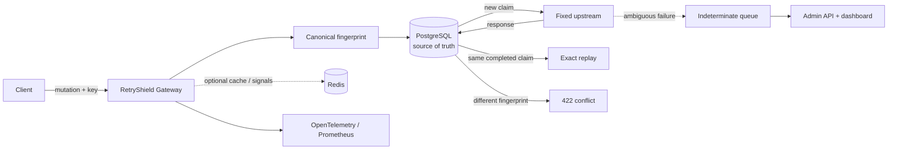
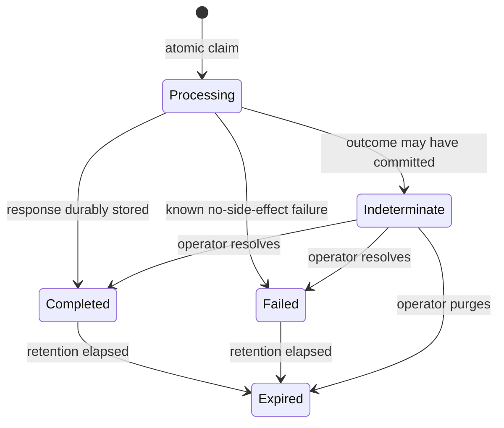

# RetryShield

**Make API retries safe—even when the outcome is uncertain.**

A self-hosted idempotency gateway that prevents duplicate side effects, replays exact responses, and stops unsafe retries when an upstream outcome cannot be proven.

[](https://github.com/Rezakarimzadeh98/retryshield/actions/workflows/ci.yml)
[](https://github.com/Rezakarimzadeh98/retryshield/actions/workflows/codeql.yml)
[](LICENSE)
[](https://dotnet.microsoft.com/)
[](https://github.com/Rezakarimzadeh98/retryshield/releases/latest)
[](https://github.com/Rezakarimzadeh98/retryshield/pkgs/container/retryshield-gateway)
[](https://securityscorecards.dev/viewer/?uri=github.com/Rezakarimzadeh98/retryshield)


[Quick start](#quick-start) · [Client contract](docs/client-integration.md) · [Guarantees](docs/guarantees.md) · [Operations](docs/operations.md) · [Contributing](CONTRIBUTING.md) · [Security](SECURITY.md)

## What RetryShield is for

Put RetryShield in front of mutation endpoints where an accidental duplicate has a real cost:

- **payments and payouts** — prevent a timed-out client from charging twice;
- **orders and reservations** — stop duplicate inventory changes or bookings;
- **invoices and provisioning** — return the first result without repeating the side effect;
- **webhook consumers and internal APIs** — make at-least-once delivery safe and observable.

It is designed for backend, platform, SRE, and fintech teams that need one reusable idempotency boundary instead of rebuilding retry handling in every service.

## The failure RetryShield handles

A client sends `POST /payments`. The payment service commits the charge, but its response is lost. The client times out and retries. A normal reverse proxy forwards the request again; RetryShield does not.

RetryShield claims an idempotency key in PostgreSQL **before** forwarding the mutation. It then:

- replays the original status, headers, and body for a completed request;
- rejects the same key with a different payload as `422 Unprocessable Entity`;
- waits briefly for an identical in-flight request, then returns `409 Conflict`;
- marks ambiguous delivery failures as `indeterminate`, requiring an operator decision instead of guessing.

> RetryShield does not promise magical “exactly once” delivery. It makes duplicates observable and prevents automatic retries when the outcome is unknowable. Read the precise [guarantees and limits](docs/guarantees.md).


## Quick start

Requirements: Docker with Compose v2.

Run the released multi-architecture images—no .NET or Node.js toolchain required:

```bash
git clone https://github.com/Rezakarimzadeh98/retryshield.git
cd retryshield
cp deploy/.env.example deploy/.env
docker compose --env-file deploy/.env \
  --profile demo -f deploy/compose.yml -f deploy/compose.release.yml up -d
```

PowerShell:

```powershell
git clone https://github.com/Rezakarimzadeh98/retryshield.git
Set-Location retryshield
Copy-Item deploy/.env.example deploy/.env
docker compose --env-file deploy/.env `
  --profile demo -f deploy/compose.yml -f deploy/compose.release.yml up -d
```

To build every component from source instead, use
`docker compose --env-file deploy/.env --profile demo -f deploy/compose.yml up --build`.

Send the same payment mutation twice:

```bash
curl -i http://localhost:8080/proxy/payments \
  -X POST \
  -H "Content-Type: application/json" \
  -H "Idempotency-Key: demo-payment-001" \
  -d '{"amount":4200,"currency":"USD"}'

curl -i http://localhost:8080/proxy/payments \
  -X POST \
  -H "Content-Type: application/json" \
  -H "Idempotency-Key: demo-payment-001" \
  -d '{"amount":4200,"currency":"USD"}'
```

The first response includes `Idempotency-Status: created`; the second is returned from durable storage with `Idempotency-Status: replayed`. The demo upstream counter remains `1`.

```bash
curl http://localhost:8082/payments/count
```

| Surface | URL | Default local credential |
| --- | --- | --- |
| Gateway | <http://localhost:8080> | — |
| Operations dashboard | <http://localhost:3000> | `dev-admin-token-change-me` |
| Admin API / OpenAPI | <http://localhost:8081> | Bearer token above |
| Demo upstream | <http://localhost:8082> | — |
| Prometheus | <http://localhost:9090> | — |
| Grafana | <http://localhost:3001> | `admin` / `retryshield` |

Defaults are for local evaluation only. Replace every credential and encryption key before deployment.
Before integrating a real client, follow the [key lifecycle and retry contract](docs/client-integration.md)—especially the rule that an indeterminate outcome must never be retried with a new key.

## What ships in the stack

- **Gateway data plane** — atomic PostgreSQL claims, exact replay, bounded duplicate waiting, payload-conflict detection, and explicit indeterminate outcomes.
- **Operations control plane** — authenticated API and React dashboard for searching records, reading timelines, resolving uncertainty, and purging expired data.
- **Observability** — OpenTelemetry instrumentation, Prometheus metrics, a provisioned Grafana dashboard, health probes, and operational guidance.
- **Security baseline** — fixed upstream origin, bounded bodies, header allowlists, AES-GCM payload protection, non-root/read-only containers, CodeQL, dependency review, SBOM, provenance, and Scorecard.
- **Proof and failure tooling** — domain and architecture tests, PostgreSQL Testcontainers coverage for 50 concurrent claims, a full-stack replay smoke test, a payment demo, and documented chaos scenarios.

## How it works



PostgreSQL is authoritative. A Redis outage can reduce efficiency but cannot allow a duplicate forward. The upstream base address is fixed at startup, so request input cannot turn the gateway into an open proxy.

## State machine



Illegal transitions are rejected in the domain layer. Request fingerprints are scoped by tenant and route; keys are not global across unrelated operations.

## Core behavior

| Situation | Result | Upstream forwards |
| --- | --- | ---: |
| First valid key | Claim and forward | 1 |
| Same key + same request after completion | Exact stored response | 0 |
| Same key + different request | `422` | 0 |
| Same key while processing | Bounded wait, then `409` | 0 |
| Response lost after dispatch | `indeterminate` | 0 automatic retries |
| Redis unavailable | PostgreSQL path continues | At most the valid claim |

Stored bodies can be encrypted with AES-GCM. Request/response sizes, retained headers, routes, and retention are bounded and configurable.

## Configuration

The Compose stack documents every setting in [`deploy/.env.example`](deploy/.env.example). Important values:

- `RetryShield__PostgresConnectionString`: authoritative idempotency store.
- `RetryShield__RedisConnectionString`: optional pub/sub optimization.
- `Gateway__UpstreamBaseUrl`: fixed, trusted upstream origin.
- `Gateway__DefaultTenant`: fixed scope for this single-tenant v1 deployment; clients cannot override it.
- `RetryShield__EncryptionKeyBase64`: 16/24/32-byte key encoded as Base64.
- `Gateway__MaxBodyBytes` / `Gateway__MaxResponseBodyBytes`: memory and storage limits.
- `Gateway__DuplicateWait`: duplicate wait budget.
- `Gateway__RecordTtl`: record retention window.
- `RetryShield__ProcessingTimeout`: crash-window threshold; keep it above the upstream timeout.
- `Admin__BearerToken`: operations API bearer token.

See [operations](docs/operations.md) for rotation, health probes, cleanup, alerts, and recovery.

## Architecture

```text
src/
├── RetryShield.Domain          # state machine and invariants; no infrastructure
├── RetryShield.Application     # use cases and ports
├── RetryShield.Infrastructure  # PostgreSQL, Redis, encryption, cleanup
├── RetryShield.Gateway         # HTTP ingress and safe upstream forwarding
└── RetryShield.AdminApi        # authenticated operational control plane
web/admin                       # React operations dashboard
samples/RetryShield.DemoUpstream
tests/                          # unit, architecture, concurrency, integration
deploy/                         # Compose, Prometheus, Grafana
```

Architecture decisions are recorded in [`docs/adr`](docs/adr). The data plane and control plane are separate processes so the dashboard cannot sit on the mutation hot path.

## Development

Use the pinned .NET SDK and Node.js 24+:

```bash
dotnet restore
dotnet build --no-restore
dotnet test --no-build

cd web/admin
npm ci
npm test
npm run build
```

Run the deterministic 50-client exercise after starting the Compose stack:

```bash
k6 run scripts/load/50-concurrency.js
```

## Published images

Every semantic release publishes signed-build provenance and SBOM-enabled Linux images for `amd64` and `arm64`:

```text
ghcr.io/rezakarimzadeh98/retryshield-gateway
ghcr.io/rezakarimzadeh98/retryshield-admin-api
ghcr.io/rezakarimzadeh98/retryshield-admin-dashboard
ghcr.io/rezakarimzadeh98/retryshield-demo
```

Use a version tag such as `0.2.0` in production instead of a moving tag. RetryShield is currently a `0.x` public preview: evaluate it against the documented guarantees, replace development secrets, and test backup and recovery before production use.

For a real upstream, set `UPSTREAM_BASE_URL` and use the documented
[production Compose overlay](docs/operations.md#production-baseline), which keeps the demo service disabled.

## Roadmap

- Pluggable route policies and tenant-aware quotas
- First-class reconciliation hooks for indeterminate outcomes
- Additional storage adapters with the same safety contract
- Kubernetes manifests and a Helm chart
- SDK helpers for common client frameworks

The roadmap is intentionally issue-driven. If one of these would solve a real production problem, open a discussion with the failure mode and constraints.

## Contributing

Focused contributions are welcome: storage correctness, adversarial tests, observability, dashboard accessibility, and documentation all have clear boundaries. Start with [CONTRIBUTING.md](CONTRIBUTING.md) and issues labeled [`good first issue`](https://github.com/Rezakarimzadeh98/retryshield/issues?q=is%3Aissue+is%3Aopen+label%3A%22good+first+issue%22).

If RetryShield solves a real failure mode for you, a GitHub star, a reproducible issue, or a short note in [Discussions](https://github.com/Rezakarimzadeh98/retryshield/discussions) helps shape the next release.

## License

MIT © [Reza Karimzadeh](https://github.com/Rezakarimzadeh98)
