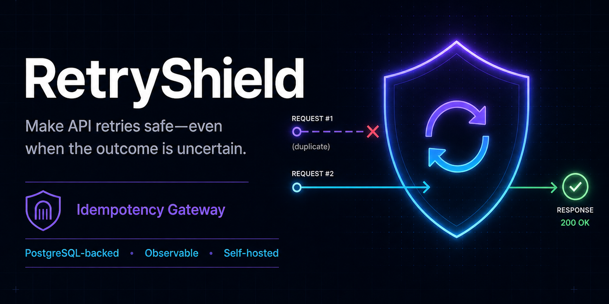
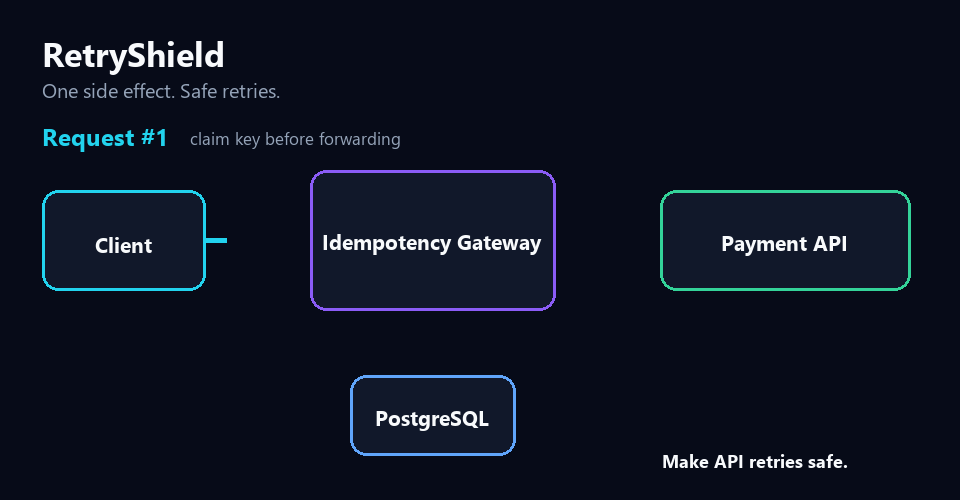
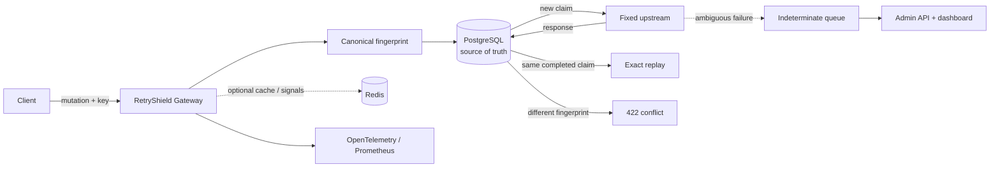
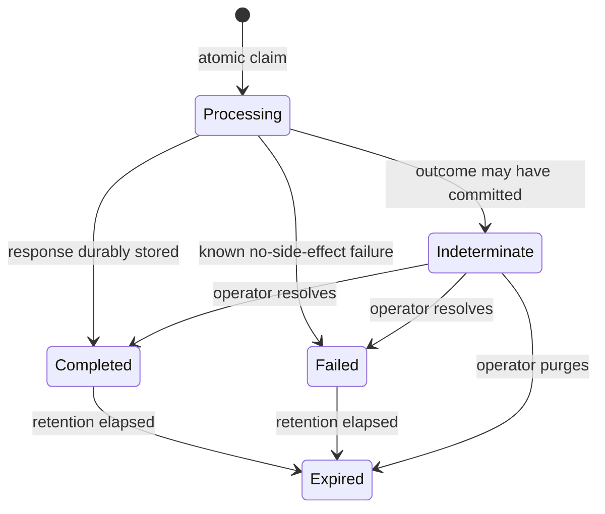

# RetryShield

**Make API retries safe—even when the outcome is uncertain.**

Self-hosted **idempotency gateway** for mutation APIs. Prevent duplicate payments, orders, bookings, and other side effects when clients timeout and retry. Claim the `Idempotency-Key` in PostgreSQL before forwarding, replay the exact response, and stop automatic retries when the upstream outcome cannot be proven.

[](https://github.com/Rezakarimzadeh98/retryshield/actions/workflows/ci.yml)
[](https://github.com/Rezakarimzadeh98/retryshield/actions/workflows/codeql.yml)
[](LICENSE)
[](https://dotnet.microsoft.com/)
[](https://github.com/Rezakarimzadeh98/retryshield/releases/latest)
[](https://github.com/Rezakarimzadeh98/retryshield/pkgs/container/retryshield-gateway)
[](https://securityscorecards.dev/viewer/?uri=github.com/Rezakarimzadeh98/retryshield)
[](https://github.com/Rezakarimzadeh98/retryshield/discussions)



[Why this exists](docs/why-retryshield.md) · [Quick start](#quick-start) · [FAQ](docs/faq.md) · [Client contract](docs/client-integration.md) · [Contribute](docs/contribute.md) · [Guarantees](docs/guarantees.md)

If this solves a failure you have hit in production: star the repo, open a Discussion with the incident shape, or grab a [`good first issue`](https://github.com/Rezakarimzadeh98/retryshield/issues?q=is%3Aissue+is%3Aopen+label%3A%22good+first+issue%22).

## Who this is for

- backend/platform engineers protecting payment, payout, checkout, booking, invoice, or provisioning APIs
- teams searching for Stripe-style `Idempotency-Key` behavior as a reusable gateway instead of one-off middleware
- SRE/DevOps engineers who want Compose, GHCR images, Prometheus alerts, Grafana, and an ops dashboard
- contributors who like distributed-systems correctness, React operations UI, observability, or developer docs

## The failure people Google

A client sends `POST /payments`. The payment service commits the charge. The response is lost. The client times out and retries.

A normal reverse proxy forwards again. **RetryShield does not.**



RetryShield claims the key in PostgreSQL **before** forwarding, then:

- replays the original status, headers, and body for a completed request;
- rejects the same key with a different payload as `422`;
- waits briefly for an identical in-flight request, then returns `409`;
- marks ambiguous delivery failures as `indeterminate` so operators decide instead of guessing.

> RetryShield does not promise magical “exactly once” delivery. It makes duplicates observable and prevents automatic retries when the outcome is unknowable. Read the [guarantees](docs/guarantees.md) and [why it exists](docs/why-retryshield.md).

## Quick start

Requirements: Docker with Compose v2. No .NET or Node.js toolchain needed for the released images.

```bash
git clone https://github.com/Rezakarimzadeh98/retryshield.git
cd retryshield
cp deploy/.env.example deploy/.env
docker compose --env-file deploy/.env \
  --profile demo -f deploy/compose.yml -f deploy/compose.release.yml up -d
```

PowerShell:

```powershell
git clone https://github.com/Rezakarimzadeh98/retryshield.git
Set-Location retryshield
Copy-Item deploy/.env.example deploy/.env
docker compose --env-file deploy/.env `
  --profile demo -f deploy/compose.yml -f deploy/compose.release.yml up -d
```

Send the same payment mutation twice:

```bash
curl -i http://localhost:8080/proxy/payments \
  -X POST \
  -H "Content-Type: application/json" \
  -H "Idempotency-Key: demo-payment-001" \
  -d '{"amount":4200,"currency":"USD"}'

curl -i http://localhost:8080/proxy/payments \
  -X POST \
  -H "Content-Type: application/json" \
  -H "Idempotency-Key: demo-payment-001" \
  -d '{"amount":4200,"currency":"USD"}'

curl http://localhost:8082/payments/count
```

### Expected result

| Attempt | `Idempotency-Status` | Upstream payment count |
| --- | --- | ---: |
| First | `created` | `1` |
| Second | `replayed` | still `1` |

Then open:

| Surface | URL | Local credential |
| --- | --- | --- |
| Operations dashboard | <http://localhost:3000> | `dev-admin-token-change-me` |
| Admin API / OpenAPI | <http://localhost:8081> | Bearer token above |
| Grafana | <http://localhost:3001> | `admin` / `retryshield` |
| Prometheus | <http://localhost:9090> | — |

Defaults are for local evaluation only. Replace every credential before production use. Client rules live in [client-integration.md](docs/client-integration.md); a copy-paste .NET helper is in [`samples/dotnet-client`](samples/dotnet-client).

## Why teams adopt it

| Need | What ships |
| --- | --- |
| Stop duplicate side effects | Atomic PostgreSQL claim before forward |
| Safe retries after timeout | Exact response replay with stable keys |
| Uncertain upstream outcomes | Explicit `indeterminate` state + operator resolution |
| Ops visibility | React dashboard, timelines, Prometheus alerts, Grafana |
| Production packaging | Multi-arch GHCR images, Compose demo/production overlays, smoke test |
| Trust | Domain/architecture tests, PostgreSQL 50-way concurrency tests, full-stack replay proof |

## How it works



PostgreSQL is authoritative. Redis outage cannot create a second owner for the same key. The upstream origin is fixed at startup, so request input cannot turn the gateway into an open proxy.

## State machine



## Core behavior

| Situation | Result | Upstream forwards |
| --- | --- | ---: |
| First valid key | Claim and forward | 1 |
| Same key + same request after completion | Exact stored response | 0 |
| Same key + different request | `422` | 0 |
| Same key while processing | Bounded wait, then `409` | 0 |
| Response lost after dispatch | `indeterminate` | 0 automatic retries |
| Redis unavailable | PostgreSQL path continues | At most the valid claim |

## Help make it better

RetryShield grows fastest when adopters and contributors attack one sharp edge at a time:

- **Use it** against a real mutation API and report the failure mode
- **Review** architecture decisions in [`docs/adr`](docs/adr) and the guarantees doc
- **Contribute** client SDKs, Helm/Kubernetes packaging, reconciliation hooks, dashboard UX, or docs
- **Start small** with [`docs/contribute.md`](docs/contribute.md) and [`good first issue`](https://github.com/Rezakarimzadeh98/retryshield/issues?q=is%3Aissue+is%3Aopen+label%3A%22good+first+issue%22)

Ready-to-post launch text lives in [`docs/SHARE.md`](docs/SHARE.md).

## Configuration

Important values from [`deploy/.env.example`](deploy/.env.example):

- `UPSTREAM_BASE_URL`: protected upstream origin for production
- `RetryShield__PostgresConnectionString`: authoritative store
- `RetryShield__RedisConnectionString`: optional acceleration
- `RetryShield__EncryptionKeyBase64`: AES-GCM key for stored bodies
- `Gateway__MaxBodyBytes` / `Gateway__MaxResponseBodyBytes`
- `Gateway__DuplicateWait` / `Gateway__RecordTtl`
- `RetryShield__ProcessingTimeout`
- `Admin__BearerToken`

Production overlay, alerts, and recovery: [operations](docs/operations.md).

## Architecture

```text
src/
├── RetryShield.Domain          # state machine and invariants
├── RetryShield.Application     # use cases and ports
├── RetryShield.Infrastructure  # PostgreSQL, Redis, encryption, migrations
├── RetryShield.Gateway         # mutation ingress
└── RetryShield.AdminApi        # control plane
web/admin                       # React operations dashboard
samples/                        # demo upstream + client examples
tests/                          # unit, architecture, PostgreSQL, concurrency
deploy/                         # Compose, Prometheus, Grafana
```

## Development

```bash
dotnet restore
dotnet build --no-restore
dotnet test --no-build

cd web/admin
npm ci
npm test
npm run build
```

Full-stack proof after Compose is up:

```bash
bash scripts/smoke.sh
k6 run scripts/load/50-concurrency.js
```

## Published images

```text
ghcr.io/rezakarimzadeh98/retryshield-gateway
ghcr.io/rezakarimzadeh98/retryshield-admin-api
ghcr.io/rezakarimzadeh98/retryshield-admin-dashboard
ghcr.io/rezakarimzadeh98/retryshield-demo
```

Prefer version tags such as `0.2.0` over moving tags. This is a `0.x` public preview: evaluate guarantees, rotate secrets, and rehearse backup/recovery before production.

## Roadmap

- SDK helpers for common client stacks
- Kubernetes manifests and Helm chart
- First-class reconciliation hooks for indeterminate outcomes
- Pluggable route policies and tenant-aware quotas
- Additional storage adapters with the same safety contract

Vote with issues and Discussions. Real incident reports beat abstract feature requests.

## License

MIT © [Reza Karimzadeh](https://github.com/Rezakarimzadeh98)
